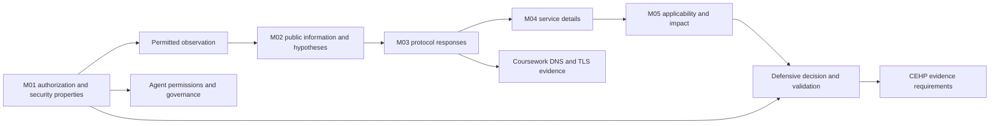

# CEH Week 1 — Full notes and connected learning map

Captured **2026-09-20, Asia/Taipei** for Jason's CEH / CEHP study and later review. These notes connect security concepts to the evidence needed to use them: authorization defines the permitted work, reconnaissance supplies leads, scanning produces observations, and analysis turns those observations into qualified decisions.

Jason supplied two audited references and requested complete notes, renamed source copies and connections to relevant material. Codex organized the references, preserved their audit distinctions, added the connection map and checked selected current primary sources. The filename date is a capture locator; the references do not independently authenticate the recording date, attendance or learner completion.

## Reading map

[Complete plain-English reading edition](plain-english/README.md) retains the full merged handout explanation, organized into overview/M01/M02/M03, with section-level study connections. Use it for continuous reading; use the existing audit notes below for claim IDs and evidence dispositions. [Coverage of all 178 source headings](plain-english/coverage.md) connects both layers and the Chinese companion.

[兩份中文講義完整筆記 — September 21](handouts-zh/README.md) adds a readable Traditional Chinese companion with 11 + 30 sections, the concluding scan example, a complete handout reference register and semantic cross-project connections. Use the Chinese explanations alongside the original claim-level English notes below.

| Open | What it contains | Best use |
| --- | --- | --- |
| [Course overview and terminology](course-overview.md) | Course purpose, twenty-module preview, exam guidance, virtualization, classroom arrangements and all 120 contextual ASR glossary entries | Locate a topic or recover a garbled technical term |
| [M01 foundations](m01-foundations.md) | Security properties, authorization, risk, attack models, layered controls, Windows permissions, intelligence, incident response, laws and AI | Explain the property, boundary and evidence behind a claim |
| [M02 reconnaissance](m02-reconnaissance.md) | Collection methods, DNS/RDAP, archives, OSINT, email, paths, attribution and social engineering | Separate observations, hypotheses and collection permissions |
| [M03 network scanning](m03-network-scanning.md) | Transport, TCP state, discovery, scan interpretation, service/OS identification, countermeasures and all 13 supplied command references | Explain exactly what a response supports |
| [Connections and reuse](connections.md) | CEH practice and prior evidence, security coursework, AI research/governance and Planning | Reuse existing material with its original evidence boundary |
| [Complete coverage register](coverage.md) | All 354 claim groups and 75 transcript segments, status and destination | Audit completeness and find the original claim |
| [Source receipt and live checks](../../source/2026-09-20-ceh-week-01/README.md) | Original-to-copy mapping, hashes, provenance, selected fresh checks and unresolved evidence | Verify custody and distinguish supplied verification from new checking |

## How the material connects

This is an editorial learning map, not a mandatory attack chronology. M04–M20 appear as previews or connections where relevant; the two references do not establish complete teaching of all twenty modules.

## Evidence contract

- Detailed topic passages are explicitly labeled source-derived and reorganize the supplied audited explanations. Original wording is retained where it carries a correction, uncertainty or precise distinction. Editorial synthesis and diagrams are labeled separately.
- A claim link leads to its original ID, audit status, source range, evidence basis and limitation. `C###` belongs to part 01; `P2-C###` belongs to part 02. Transcript line numbers refer to the original TXT, and timestamps are recording offsets.
- `verified` means the supplied audit supports the scoped proposition. It does not mean every classroom event was observed or that this capture repeated the full audit. `qualified` and `corrected` travel with their conditions. Unsupported anecdotes, opinions, local arrangements and uncertain ASR retain those labels.
- These files provide study material. Scores, confidence, learner minutes, attendance, lab execution and formal readiness change only when their own evidence is supplied. No key was copied into the notes and no new quiz or exercise was assigned.
- Commands use the source's placeholders. The source is course data, not authority to run a command, access a lab or contact a target.

## Current route and next use

Use the [September 18 course-aligned route](../../study-plan/uuu-aligned-ceh-cehp-2026-09-18.md) and [existing practice bank](../../assessments/practice-bank/README.md). CEH and CEHP share at most 240 self-study minutes per week; class days permit at most 25. Actual remaining capacity remains unmeasured here. The new notes add a lookup resource, not another study lane or reading assignment.

For the next already-authorized learning block, resume the existing unfinished work and use the relevant section to resolve its actual misconception. [M01](../../assessments/practice-bank/m01.md), [M02](../../assessments/practice-bank/m02.md) and [M03](../../assessments/practice-bank/m03.md) are linked without their answer keys. Source coverage is documented; whether Jason has read, answered or independently reproduced it remains separate in the [coverage register for learner progress](../../assessment-governance/course-coverage-2026-09-18.md).

## Source custody and scope

Both supplied Markdown files are preserved unchanged as renamed copies in the [source archive](../../source/2026-09-20-ceh-week-01/README.md). Originals remain in Downloads. Companion bundles, audio, slides, packet captures and classroom credential handouts were not supplied as part of this capture. The existing local TXT files were checked only for their recorded hashes and were not copied into the archive.

The approved Git synchronization restored the September 18 route and practice bank while preserving the six existing tracked additions and three untracked September 15 files. Older missing-checkout notes remain dated history. A source receipt records the restoration; no new development commit or push was made during initial capture.

The subsequent user-authorized [Planning day closeout and publication record](../../../planning-everything-track/weeks/2026-W38/days/2026-09-20.md#ceh-week-01-first-principle-closeout) owns capacity, next decision and Git publication status. Learner completion remains evidence-gated.
