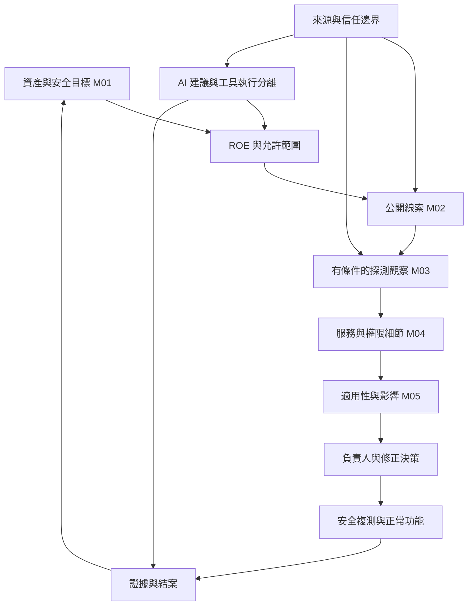

# 概念連結：從安全目標到可驗證決策

[中文總覽](README.md) · [講義一](part-01.md) · [講義二](part-02.md) · [既有跨專案完整地圖](../connections.md)

這是編輯建立的學習關聯，不是課堂宣稱的固定攻擊流程。連結的價值是指明概念如何接到實作、證據與責任。既有文件仍保留各自來源、時間與驗收狀態；相同主題不轉移授權或學習完成度。

## 1. 同一條證據鏈，六個不同結論

| 要回答的問題 | 中文講義入口 | 既有文件／使用方式 | 保留界線 |
| --- | --- | --- | --- |
| 該保護什麼？ | [五要素](part-01.md#h1-04) | [M01 英文查核](../m01-foundations.md#security-properties)：分開揭露、改動、服務、來源與行為證據 | 控制可支持多個目標；不保證全能 |
| 可做哪些測試？ | [八步流程](part-01.md#h1-09) | [ROE 來源](../../../source/2026-09-04-antisyphon-roe-101/source.md)、[W36](../../../projects/weekly-incident-projects/2026-W36-authorization-gate/README.md)：用時段、地點、方法、停止／恢復規則理解顧問案例 | 歷史 ROE 不授權本次或新目標 |
| 發現了什麼？ | [偵察](part-02.md#h2-11)、[DNS](part-02.md#h2-15) | [DNS lab](../../../../nycu_114-2_network_security_practices/labs/dns-reconnaissance/README.md)：逐類記錄輸出、意思與不能證明什麼 | 題目描述不是已完成查詢 |
| 系統回答什麼？ | [掃描判讀](part-02.md#worked-example) | [W37 metadata comparison](../../../projects/weekly-incident-projects/2026-W37-forgotten-portal-discovery/continuation-2026-09-09-1948/metadata-comparison.md)：分開可達、服務自報與登錄缺口 | HTTP 200 與自報版本不證明 accountable owner、漏洞或 exploitability |
| 弱點如何造成傷害？ | [六個詞](part-01.md#h1-05)、[風險](part-02.md#h2-05) | [M05 weakness-to-harm](../../m05-vulnerability-analysis/lesson-01-weakness-to-harm.md)：逐筆授權 → 缺口 → 利用 → 揭露 → 情境化風險 | 教學假設不等於真實系統已被測試；不捏造數值風險 |
| 修正真的有效？ | [複測與結案](part-01.md#h1-09) | [Practical tasks](../../../assessments/practice-bank/practical.md)：將預期行為與需保存證據對齊 | 需實際學員執行及原任務驗收，不由筆記代替 |

關鍵連結：**線索 → 觀察 → 推論 → 決策**之間都需要條件。名稱、版本、port 與地理位置是各自的證據，不能合併成「已確認被入侵」。

## 2. 四種「可信」要分開驗證

| 概念接點 | 文件與可重用內容 | 與講義的共同問題 | 不能跨越的推論 |
| --- | --- | --- | --- |
| OS 身分與物件權限 | [Windows access control](../../../../nycu_114-2_network_security_practices/handouts/windows-access-control.md)；[H2 §4](part-02.md#h2-04) | principal／token／object／DACL：誰要求哪項操作？ | SID 顯示失敗不等於授權取消；離線磁碟是另一保護界線 |
| 加密來源與通訊 | [mTLS evidence map](../../../../nycu_114-2_network_security_practices/homeworks/hw02-tls-bidirectional-certificates/report/evidence-map.md)；[H1 §4](part-01.md#h1-04) | 既有有效憑證、缺憑證、錯 CA 案例，區分可信金鑰、握手、應用回應 | 報告記錄歸原課程；本次未重跑、未複製私鑰／PCAP，也不把 TLS 驗證說成業務逐筆授權 |
| AI 輸入與執行權限 | [AI research charter](../../../../ai-cybersecurity-agent-research/docs/research-charter.md)；[H1 §10](part-01.md#h1-10) | 有限工具、執行回饋、獨立 verifier 與 logs，使生成建議和實際效果分開 | Charter 比較組是候選研究，不是改善效果已證明；本次不啟動實驗 |
| ML 預測與證據判斷 | [CSCM30018 備課筆記](../../../../nycu-115-1-coursework/cscm30018/lectures/2026-09-15-image-processing-ml-crime-detection/notes.md)；[H2 §9](part-02.md#h2-09) | 標記、特徵與評估條件影響結果；影像更清楚、辨識率提升、鑑識價值不同 | 異常或模型預測不是法律認定，不能自行推出準確率／犯罪身分 |

AI agent 接外部報告，與網站接使用者表單，在「哪些輸入可當權威」上有可比較的信任邊界；兩者機制不同，不能把 prompt injection 當成 SQL injection 的同一漏洞。共同可重用的工程問題是：資料如何影響有權操作、在哪裡檢查、如何限制、如何驗證結果。

## 3. 回到二十模組與 CEHP 的查找路徑

[官方範圍表](../../../curriculum/official-scope-map.md)決定課綱；[實作題本](../../../assessments/practice-bank/practical.md)決定任務驗收。以下只是概念路由。

| 講義概念 | 後續模組 | CEHP 連結 |
| --- | --- | --- |
| 安全目標、授權、證據、風險 | M01；所有模組共享前提 | P1–P5 都需明確權限和結果證據 |
| DNS、port、版本、OS | M02 → M03 → M04 → M05 | P1 掃描、P2 服務辨識／列舉 |
| 封包、TCP、session、TLS | M08、M11、M20 | P3 流量分析；內容可見性與驗證範圍 |
| 假程式、端點、C2、模型分類 | M06、M07、M09、M12 | P4 系統攻擊分析與控制／應變 |
| 網站服務、逐筆授權、SQL 參數 | M13、M14、M15 | P5 網站攻擊分析與修復驗證 |
| 無線、手機、OT、雲端 | M16–M19 | 先辨資料流、管理權與實體影響；講義只是導覽 |

[既有 M01 題本](../../../assessments/practice-bank/m01.md)、[M02 題本](../../../assessments/practice-bank/m02.md)、[M03 題本](../../../assessments/practice-bank/m03.md)保留原題 ID，不在此複製答案。日後實際學習仍依[9/18 現行路徑](../../../study-plan/uuu-aligned-ceh-cehp-2026-09-18.md)使用英文題目／選項／提示與 plain-English 解釋；中文筆記作理解支援。首答、信心、三變式重測與實作各自存證。

## 4. Planning、評量與 Blog 的責任

- [Planning CEH locator](../../../../planning-everything-track/data/projects/2026-07-ceh-cehp-certification-training.md)保留本次整理位置、狀態、下一步；詳細內容屬此 repo。
- [課程覆蓋](../../../assessment-governance/course-coverage-2026-09-18.md)只因實際閱讀／答案／執行證據更新。41 節筆記齊備不是 20 模組讀完。
- [現行路徑與 daily Blog 更新](../../../study-plan/uuu-aligned-ceh-cehp-2026-09-18.md#daily-bilingual-blog-acceptance--september-21)保留 Jason 先解釋、編輯整理與翻譯、確認後再驗證公開 URL 的流程。這份筆記可供日後核對概念，但不冒充 Jason 的文章、不自動發布。
- 所有後續學習仍在 CEH／CEHP 每週共 240 分鐘、課日最多 25 分鐘之內；此次筆記整理沒有新增課表、閱讀額度或補課債。下一步是在原本已安排的學習中，按實際疑問開對應段落。

## 5. September 21 FIRST PRINCIPLE 與發布回執

[Planning 當日收尾](../../../../planning-everything-track/weeks/2026-W39/days/2026-09-21.md#ceh-handouts-first-principle)與[W39 容量](../../../../planning-everything-track/weeks/2026-W39/weekly-plan.md#ceh-handouts-september-21)承接教材成果、本人貢獻、驗證及分別提交／遠端發布回執。詳細技術留在此 repo；課程、研究及 Blog 的原驗收保持各自證據要求。
