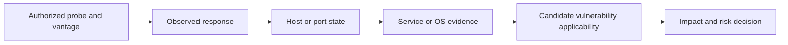
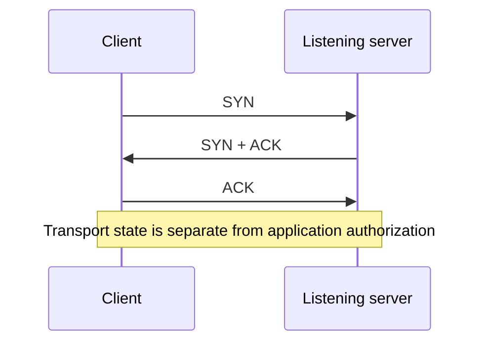

# M03 — Network scanning and interpretation

A scan is a measurement from a particular network position using a particular probe. This module connects transport behavior to the narrow conclusion an observation supports, then separates that conclusion from service identity, vulnerability and business risk.

[Week 1 index](README.md) · [Connections](connections.md) · [Complete coverage](coverage.md) · [Source receipt and live checks](../../source/2026-09-20-ceh-week-01/README.md)

Captured 2026-09-20, Asia/Taipei. Detailed sections below reorganize the user-supplied audited study references and retain their wording where precision matters. Linked claim records own status, original line ranges and evidence limits. Newly written synthesis is labeled editorial. These are study notes, not evidence of attendance, personal study completion or executed labs.

## Contents

- [Hosts, sockets and transport](#transport)
- [Headers, flags and connection state](#tcp-state)
- [Discovery and the meaning of an observation](#discovery)
- [Service and operating-system discovery](#identification)
- [Evasion topics, identity and defensive interpretation](#evasion-and-defense)
- [Countermeasures and implementation checks](#countermeasures)
- [Command reference retained from part 02](#command-reference)
- [The interpretation chain](#interpretation-chain)
- [TCP handshake as a state explanation](#handshake-model)

## Hosts, sockets and transport

*Source-derived: part 02, M03.1; qualifications retained.*

**Transcript coverage:** T002:L1594–L1724 (03:21:54–03:35:25). **Audit records:** [P2-C133](../../source/2026-09-20-ceh-week-01/ceh-week-01-part-02-m01-m03.verified.md#P2-C133) [P2-C134](../../source/2026-09-20-ceh-week-01/ceh-week-01-part-02-m01-m03.verified.md#P2-C134) [P2-C135](../../source/2026-09-20-ceh-week-01/ceh-week-01-part-02-m01-m03.verified.md#P2-C135) [P2-C136](../../source/2026-09-20-ceh-week-01/ceh-week-01-part-02-m01-m03.verified.md#P2-C136) [P2-C137](../../source/2026-09-20-ceh-week-01/ceh-week-01-part-02-m01-m03.verified.md#P2-C137) [P2-C138](../../source/2026-09-20-ceh-week-01/ceh-week-01-part-02-m01-m03.verified.md#P2-C138) [P2-C139](../../source/2026-09-20-ceh-week-01/ceh-week-01-part-02-m01-m03.verified.md#P2-C139) [P2-C140](../../source/2026-09-20-ceh-week-01/ceh-week-01-part-02-m01-m03.verified.md#P2-C140) [P2-C141](../../source/2026-09-20-ceh-week-01/ceh-week-01-part-02-m01-m03.verified.md#P2-C141) [P2-C142](../../source/2026-09-20-ceh-week-01/ceh-week-01-part-02-m01-m03.verified.md#P2-C142) [P2-C143](../../source/2026-09-20-ceh-week-01/ceh-week-01-part-02-m01-m03.verified.md#P2-C143) [P2-C144](../../source/2026-09-20-ceh-week-01/ceh-week-01-part-02-m01-m03.verified.md#P2-C144).

The lecture’s broad “host” terminology is suitable for naming a scan target, but Internet specifications distinguish end-host and router roles. **Ports** distinguish transport endpoints. The **services** file provides conventional name/number lookup; actual application delivery depends on sockets and protocol state. A port label is not proof of the running service. [P2-S054](../../source/2026-09-20-ceh-week-01/ceh-week-01-part-02-m01-m03.verified.md#P2-S054) [P2-S050](../../source/2026-09-20-ceh-week-01/ceh-week-01-part-02-m01-m03.verified.md#P2-S050) [P2-S051](../../source/2026-09-20-ceh-week-01/ceh-week-01-part-02-m01-m03.verified.md#P2-S051)

**TCP** supplies an ordered reliable byte stream; **UDP** supplies datagrams without TCP’s built-in reliability machinery. Applications still need to interpret the result. Reliability is not encryption or proof that an application committed a transaction. The transport may be chosen by implemented configuration rather than permanently fixed by a single programmer decision. [P2-S052](../../source/2026-09-20-ceh-week-01/ceh-week-01-part-02-m01-m03.verified.md#P2-S052) [P2-S055](../../source/2026-09-20-ceh-week-01/ceh-week-01-part-02-m01-m03.verified.md#P2-S055)

The file conflates packetization, TCP segmentation and IP fragmentation. MTU and TCP payload size are different quantities. Packetization is not just a relic of poor cables: shared resources and internetworking also matter. The lecture’s 1.5K blocks and 100M transfer are explanatory numbers, not universal packet boundaries. [P2-S074](../../source/2026-09-20-ceh-week-01/ceh-week-01-part-02-m01-m03.verified.md#P2-S074) [P2-S053](../../source/2026-09-20-ceh-week-01/ceh-week-01-part-02-m01-m03.verified.md#P2-S053) [P2-S066](../../source/2026-09-20-ceh-week-01/ceh-week-01-part-02-m01-m03.verified.md#P2-S066)

## Headers, flags and connection state

*Source-derived: part 02, M03.2; qualifications retained.*

**Transcript coverage:** T002:L1725–L1790 (03:35:30–03:42:23). **Audit records:** [P2-C145](../../source/2026-09-20-ceh-week-01/ceh-week-01-part-02-m01-m03.verified.md#P2-C145) [P2-C146](../../source/2026-09-20-ceh-week-01/ceh-week-01-part-02-m01-m03.verified.md#P2-C146) [P2-C147](../../source/2026-09-20-ceh-week-01/ceh-week-01-part-02-m01-m03.verified.md#P2-C147) [P2-C148](../../source/2026-09-20-ceh-week-01/ceh-week-01-part-02-m01-m03.verified.md#P2-C148) [P2-C149](../../source/2026-09-20-ceh-week-01/ceh-week-01-part-02-m01-m03.verified.md#P2-C149) [P2-C150](../../source/2026-09-20-ceh-week-01/ceh-week-01-part-02-m01-m03.verified.md#P2-C150) [P2-C151](../../source/2026-09-20-ceh-week-01/ceh-week-01-part-02-m01-m03.verified.md#P2-C151).

**Layer boundary:** source/destination IP addresses are IP-header fields; source/destination ports are TCP-header fields. Payload means the data carried by the layer under discussion. [P2-S053](../../source/2026-09-20-ceh-week-01/ceh-week-01-part-02-m01-m03.verified.md#P2-S053) [P2-S052](../../source/2026-09-20-ceh-week-01/ceh-week-01-part-02-m01-m03.verified.md#P2-S052)

| Classic flag | Meaning to retain | Misinterpretation to avoid |
|---|---|---|
| SYN | Synchronizes sequence numbers. | Merely a generic permission request. |
| ACK | Acknowledgment field is significant. | Necessarily one separate reply per packet. |
| FIN | Sender has no more data; orderly half-close. | Unrelated to closing. |
| RST | Resets/rejects a connection under specified conditions. | A universal normal close. |
| PSH | Push-related delivery behavior. | An unconditional immediate drain of every buffer. |
| URG | Urgent-pointer field is significant. | Entire packet gets priority execution. |

These are the six classic flags emphasized in class, not an exhaustive list of all TCP control bits. For details, use the specification and urgent-mechanism clarification. [P2-S052](../../source/2026-09-20-ceh-week-01/ceh-week-01-part-02-m01-m03.verified.md#P2-S052) [P2-S068](../../source/2026-09-20-ceh-week-01/ceh-week-01-part-02-m01-m03.verified.md#P2-S068)

The common handshake is **SYN → SYN+ACK → ACK**. The common orderly-close illustration has FIN/ACK exchanges in both directions. Packet counts and the exact arrangement are not universal. The missing diagram and garbled narration are not enough to reconstruct every arrow or sequence number.

## Discovery and the meaning of an observation

*Source-derived: part 02, M03.3; qualifications retained.*

**Transcript coverage:** T002:L1791–L1917 (03:42:27–03:58:43). **Audit records:** [P2-C152](../../source/2026-09-20-ceh-week-01/ceh-week-01-part-02-m01-m03.verified.md#P2-C152) [P2-C153](../../source/2026-09-20-ceh-week-01/ceh-week-01-part-02-m01-m03.verified.md#P2-C153) [P2-C154](../../source/2026-09-20-ceh-week-01/ceh-week-01-part-02-m01-m03.verified.md#P2-C154) [P2-C155](../../source/2026-09-20-ceh-week-01/ceh-week-01-part-02-m01-m03.verified.md#P2-C155) [P2-C156](../../source/2026-09-20-ceh-week-01/ceh-week-01-part-02-m01-m03.verified.md#P2-C156) [P2-C157](../../source/2026-09-20-ceh-week-01/ceh-week-01-part-02-m01-m03.verified.md#P2-C157) [P2-C158](../../source/2026-09-20-ceh-week-01/ceh-week-01-part-02-m01-m03.verified.md#P2-C158).

**ARP discovery** observes address-resolution responses on a local IPv4 link. **ICMP echo discovery** observes echo responses, subject to filtering and configuration. Neither is a direct instrument for measuring physical power, successful OS boot or application health. Proxy responses and virtualization matter. On local Ethernet, Nmap may use ARP even when another discovery probe is selected. [P2-S077](../../source/2026-09-20-ceh-week-01/ceh-week-01-part-02-m01-m03.verified.md#P2-S077) [P2-S057](../../source/2026-09-20-ceh-week-01/ceh-week-01-part-02-m01-m03.verified.md#P2-S057)

**TCP connect scan (-sT)** and **TCP SYN scan (-sS)** use different interactions. An open TCP endpoint is not automatically FTP, a vulnerable application or a completed compromise. A SYN scan can be observed even when it avoids completing the usual handshake. Nmap’s default port selection is not “port 1 upward through every port.” [P2-S058](../../source/2026-09-20-ceh-week-01/ceh-week-01-part-02-m01-m03.verified.md#P2-S058) [P2-S063](../../source/2026-09-20-ceh-week-01/ceh-week-01-part-02-m01-m03.verified.md#P2-S063) [P2-S065](../../source/2026-09-20-ceh-week-01/ceh-week-01-part-02-m01-m03.verified.md#P2-S065)

**Editorial observation template:** record the authorized target, network vantage point, time, probe type, tool version, privilege context and response. Then state the narrow conclusion and alternatives. “No response” is not equivalent to “off”; “host up” is not a certificate of health.

The narrated six-port result and equality of two scans are classroom reports, not independently verified measurements.

## Service and operating-system discovery

*Source-derived: part 02, M03.4; qualifications retained.*

**Transcript coverage:** T002:L1918–L1994 (03:58:46–04:06:27). **Audit records:** [P2-C159](../../source/2026-09-20-ceh-week-01/ceh-week-01-part-02-m01-m03.verified.md#P2-C159) [P2-C160](../../source/2026-09-20-ceh-week-01/ceh-week-01-part-02-m01-m03.verified.md#P2-C160) [P2-C161](../../source/2026-09-20-ceh-week-01/ceh-week-01-part-02-m01-m03.verified.md#P2-C161) [P2-C162](../../source/2026-09-20-ceh-week-01/ceh-week-01-part-02-m01-m03.verified.md#P2-C162) [P2-C163](../../source/2026-09-20-ceh-week-01/ceh-week-01-part-02-m01-m03.verified.md#P2-C163).

**-v** means verbosity; **-sV** means service/version detection; **-O** requests OS fingerprinting. Version detection probes and matches responses; OS detection analyzes stack behavior. Neither depends on every OS publishing a universal banner. [P2-S076](../../source/2026-09-20-ceh-week-01/ceh-week-01-part-02-m01-m03.verified.md#P2-S076) [P2-S059](../../source/2026-09-20-ceh-week-01/ceh-week-01-part-02-m01-m03.verified.md#P2-S059) [P2-S060](../../source/2026-09-20-ceh-week-01/ceh-week-01-part-02-m01-m03.verified.md#P2-S060)

**Nmap Scripting Engine (NSE)** supplies scripts with different purposes and impact. The discussed **smb-os-discovery** script obtains information through SMB when the target exposes it. `/usr/share/nmap/scripts` is a common Linux package path, not a cross-platform guarantee. A script’s category or informative name is not blanket permission to run it. [P2-S062](../../source/2026-09-20-ceh-week-01/ceh-week-01-part-02-m01-m03.verified.md#P2-S062) [P2-S061](../../source/2026-09-20-ceh-week-01/ceh-week-01-part-02-m01-m03.verified.md#P2-S061)

**Editorial example:** a scan reports a Windows-family match. Preserve the uncertainty and the evidence. Do not silently convert it into a precise installed build, an inventory guarantee or proof of an exploitable vulnerability.

## Evasion topics, identity and defensive interpretation

*Source-derived: part 02, M03.5; qualifications retained.*

**Transcript coverage:** T002:L1995–L2197 (04:06:36–04:28:15). **Audit records:** [P2-C164](../../source/2026-09-20-ceh-week-01/ceh-week-01-part-02-m01-m03.verified.md#P2-C164) [P2-C165](../../source/2026-09-20-ceh-week-01/ceh-week-01-part-02-m01-m03.verified.md#P2-C165) [P2-C166](../../source/2026-09-20-ceh-week-01/ceh-week-01-part-02-m01-m03.verified.md#P2-C166) [P2-C167](../../source/2026-09-20-ceh-week-01/ceh-week-01-part-02-m01-m03.verified.md#P2-C167) [P2-C168](../../source/2026-09-20-ceh-week-01/ceh-week-01-part-02-m01-m03.verified.md#P2-C168) [P2-C169](../../source/2026-09-20-ceh-week-01/ceh-week-01-part-02-m01-m03.verified.md#P2-C169) [P2-C170](../../source/2026-09-20-ceh-week-01/ceh-week-01-part-02-m01-m03.verified.md#P2-C170) [P2-C171](../../source/2026-09-20-ceh-week-01/ceh-week-01-part-02-m01-m03.verified.md#P2-C171) [P2-C172](../../source/2026-09-20-ceh-week-01/ceh-week-01-part-02-m01-m03.verified.md#P2-C172) [P2-C173](../../source/2026-09-20-ceh-week-01/ceh-week-01-part-02-m01-m03.verified.md#P2-C173) [P2-C174](../../source/2026-09-20-ceh-week-01/ceh-week-01-part-02-m01-m03.verified.md#P2-C174) [P2-C175](../../source/2026-09-20-ceh-week-01/ceh-week-01-part-02-m01-m03.verified.md#P2-C175) [P2-C176](../../source/2026-09-20-ceh-week-01/ceh-week-01-part-02-m01-m03.verified.md#P2-C176) [P2-C177](../../source/2026-09-20-ceh-week-01/ceh-week-01-part-02-m01-m03.verified.md#P2-C177) [P2-C178](../../source/2026-09-20-ceh-week-01/ceh-week-01-part-02-m01-m03.verified.md#P2-C178) [P2-C179](../../source/2026-09-20-ceh-week-01/ceh-week-01-part-02-m01-m03.verified.md#P2-C179) [P2-C180](../../source/2026-09-20-ceh-week-01/ceh-week-01-part-02-m01-m03.verified.md#P2-C180).

The recording previews fragmentation, source routing, port-policy abuse, decoys, spoofing, packet construction, checksums, proxies and VPNs. These are kept as conceptual mechanisms and defensive concerns; no new operational evasion or reflection workflow is supplied.

**Important separations:** TCP segmentation is not IP fragmentation; a destination-port-80 example is not source-port manipulation; spoofed/decoy addresses are not independent authenticated scanner identities; a checksum is not a cryptographic signature. Fragmentation policy needs operational context rather than an absolute “every fragment is malicious” rule. [P2-S066](../../source/2026-09-20-ceh-week-01/ceh-week-01-part-02-m01-m03.verified.md#P2-S066) [P2-S064](../../source/2026-09-20-ceh-week-01/ceh-week-01-part-02-m01-m03.verified.md#P2-S064) [P2-S053](../../source/2026-09-20-ceh-week-01/ceh-week-01-part-02-m01-m03.verified.md#P2-S053)

**Spoofing** changes claimed source information. Reflected replies ordinarily go toward the claimed address, not automatically back to the original sender. Source-address validation is a relevant defense. MAC changes, where supported, have link-layer scope rather than global identity meaning. [P2-S067](../../source/2026-09-20-ceh-week-01/ceh-week-01-part-02-m01-m03.verified.md#P2-S067) [P2-S077](../../source/2026-09-20-ceh-week-01/ceh-week-01-part-02-m01-m03.verified.md#P2-S077)

A proxy or relay changes a path and what addresses are observed. It does not automatically make target interaction passive. No-logs statements, chained VPNs and foreign addresses do not prove inevitable anonymity or inevitable failure of an investigation. The price/server-count example has no identifiable current provider.

## Countermeasures and implementation checks

*Source-derived: part 02, M03.6; qualifications retained.*

**Transcript coverage:** T002:L2198–L2294 (04:28:19–04:38:34). **Audit records:** [P2-C181](../../source/2026-09-20-ceh-week-01/ceh-week-01-part-02-m01-m03.verified.md#P2-C181) [P2-C182](../../source/2026-09-20-ceh-week-01/ceh-week-01-part-02-m01-m03.verified.md#P2-C182) [P2-C183](../../source/2026-09-20-ceh-week-01/ceh-week-01-part-02-m01-m03.verified.md#P2-C183) [P2-C184](../../source/2026-09-20-ceh-week-01/ceh-week-01-part-02-m01-m03.verified.md#P2-C184) [P2-C185](../../source/2026-09-20-ceh-week-01/ceh-week-01-part-02-m01-m03.verified.md#P2-C185) [P2-C186](../../source/2026-09-20-ceh-week-01/ceh-week-01-part-02-m01-m03.verified.md#P2-C186) [P2-C187](../../source/2026-09-20-ceh-week-01/ceh-week-01-part-02-m01-m03.verified.md#P2-C187) [P2-C188](../../source/2026-09-20-ceh-week-01/ceh-week-01-part-02-m01-m03.verified.md#P2-C188).

Restricting ICMP echo and configuring scan detection can be useful within a defined policy, but should not be expanded into dropping all ICMP or assuming every IDS blocks traffic. Evaluate the actual rules and side effects. [P2-S073](../../source/2026-09-20-ceh-week-01/ceh-week-01-part-02-m01-m03.verified.md#P2-S073) [P2-S072](../../source/2026-09-20-ceh-week-01/ceh-week-01-part-02-m01-m03.verified.md#P2-S072)

**Apache correction:** `ServerSignature Off` controls signatures on server-generated pages, not removal of the HTTP Server header. `ServerTokens` controls information disclosed in that header. Minimize unnecessary disclosure with the actual supported configuration; arbitrary fake product names are not a substitute for patching and access control. Configuration-file paths vary by distribution. [P2-S046](../../source/2026-09-20-ceh-week-01/ceh-week-01-part-02-m01-m03.verified.md#P2-S046)

**Spoofing evidence:** TTL and IPv4 ID differences are not conclusive proof of impersonation. IDs need not form a global consecutive counter, and paths/settings can change TTL. The garbled TCP-flow comparison is not reconstructed. [P2-S069](../../source/2026-09-20-ceh-week-01/ceh-week-01-part-02-m01-m03.verified.md#P2-S069) [P2-S070](../../source/2026-09-20-ceh-week-01/ceh-week-01-part-02-m01-m03.verified.md#P2-S070) [P2-S071](../../source/2026-09-20-ceh-week-01/ceh-week-01-part-02-m01-m03.verified.md#P2-S071)

**Encryption claim:** no evidence supports the lecturer’s 80% figure. Encryption alone is not a general forged-packet filter, DDoS solution or endpoint repair. State which security property a proposed control actually protects.

The closing exercises repeat discovery, scan types and OS information in the assigned environment. Verify local instructions and access rights. No lab was accessed and no configuration was changed for this audit.

## Command reference retained from part 02

This is the supplied documentation-backed reference, retained with placeholders and qualifications. It includes RDP, identity, search and path tools that support the course as well as scanning commands. No entry is an execution request.

These are normalized templates, not verbatim command recovery. None was executed. Angle-bracket fields are placeholders, not assigned targets; they are intentionally not paste-ready shell commands. There is no universal authorization or assurance of non-disruption. The original classroom addresses and reusable credentials are excluded.

### P2-CMD001 — `mstsc /v:<AUTHORIZED_LAB_HOST>:<ASSIGNED_PORT>`

**Meaning:** Start Microsoft Remote Desktop Connection for a separately confirmed endpoint.

**Origin:** `normalized_documented_example`. **Original range:** T002:L1545–L1554. **Execution performed:** false.

**Conditions and limitations:** Endpoint, assignment, account and access window must come from the provider. This file grants no access.

**Evidence:** [P2-S049](../../source/2026-09-20-ceh-week-01/ceh-week-01-part-02-m01-m03.verified.md#P2-S049)

### P2-CMD002 — `whoami`

**Meaning:** Display the effective user name; this is not an elevation command.

**Origin:** `normalized_documented_example`. **Original range:** T002:L1807–L1811. **Execution performed:** false.

**Conditions and limitations:** Local inspection only. A root result does not establish authorization for network activity.

**Evidence:** [P2-S085](../../source/2026-09-20-ceh-week-01/ceh-week-01-part-02-m01-m03.verified.md#P2-S085)

### P2-CMD003 — `nmap -sn -PR <AUTHORIZED_LOCAL_IPV4>`

**Meaning:** ARP-based host discovery without a port scan.

**Origin:** `normalized_documented_example`. **Original range:** T002:L1812–L1841. **Execution performed:** false.

**Conditions and limitations:** Relevant on the local Ethernet/IPv4 link. A response is not a physical power-state measurement.

**Evidence:** [P2-S057](../../source/2026-09-20-ceh-week-01/ceh-week-01-part-02-m01-m03.verified.md#P2-S057)

### P2-CMD004 — `nmap -sn -PE <AUTHORIZED_IPV4_TARGET>`

**Meaning:** Request ICMP echo host discovery without port scanning.

**Origin:** `editorial_documented_equivalent_of_unclear_ASR`. **Original range:** T002:L1842–L1860. **Execution performed:** false.

**Conditions and limitations:** Local Ethernet may use ARP instead; privilege and other discovery behavior matter. The ASR does not preserve a reliable literal -PE command.

**Evidence:** [P2-S057](../../source/2026-09-20-ceh-week-01/ceh-week-01-part-02-m01-m03.verified.md#P2-S057)

### P2-CMD005 — `nmap -sT <AUTHORIZED_TARGET>`

**Meaning:** Use TCP connect scanning.

**Origin:** `normalized_documented_example`. **Original range:** T002:L1861–L1887. **Execution performed:** false.

**Conditions and limitations:** Uses actual connection attempts. May be logged; no arbitrary public targets are authorized.

**Evidence:** [P2-S058](../../source/2026-09-20-ceh-week-01/ceh-week-01-part-02-m01-m03.verified.md#P2-S058)

### P2-CMD006 — `nmap -sS <AUTHORIZED_TARGET>`

**Meaning:** Use TCP SYN scanning, subject to platform/privilege support.

**Origin:** `normalized_documented_example`. **Original range:** T002:L1888–L1917. **Execution performed:** false.

**Conditions and limitations:** Not invisible or log-free. Do not infer stealth from the phrase half-open.

**Evidence:** [P2-S058](../../source/2026-09-20-ceh-week-01/ceh-week-01-part-02-m01-m03.verified.md#P2-S058)

### P2-CMD007 — `nmap -p 21 -sV <AUTHORIZED_TARGET>`

**Meaning:** Select TCP port 21 and request service/version detection.

**Origin:** `normalized_documented_example`. **Original range:** T002:L1918–L1925. **Execution performed:** false.

**Conditions and limitations:** Port 21 alone is not proof of FTP; product matches are evidence with uncertainty, not exploit validation.

**Evidence:** [P2-S063](../../source/2026-09-20-ceh-week-01/ceh-week-01-part-02-m01-m03.verified.md#P2-S063) [P2-S059](../../source/2026-09-20-ceh-week-01/ceh-week-01-part-02-m01-m03.verified.md#P2-S059)

### P2-CMD008 — `nmap -O <AUTHORIZED_TARGET>`

**Meaning:** Request TCP/IP OS fingerprinting.

**Origin:** `normalized_documented_example`. **Original range:** T002:L1967–L1971. **Execution performed:** false.

**Conditions and limitations:** An inference, not a definitive installed-OS certificate. Suitable port conditions and privilege may be needed.

**Evidence:** [P2-S060](../../source/2026-09-20-ceh-week-01/ceh-week-01-part-02-m01-m03.verified.md#P2-S060)

### P2-CMD009 — `nmap --script smb-os-discovery <AUTHORIZED_TARGET>`

**Meaning:** Select the named SMB information script.

**Origin:** `normalized_documented_example`. **Original range:** T002:L1972–L1994. **Execution performed:** false.

**Conditions and limitations:** Review the script and permissions first. Fields may be missing; no blanket authorization for other NSE scripts follows.

**Evidence:** [P2-S061](../../source/2026-09-20-ceh-week-01/ceh-week-01-part-02-m01-m03.verified.md#P2-S061) [P2-S062](../../source/2026-09-20-ceh-week-01/ceh-week-01-part-02-m01-m03.verified.md#P2-S062)

### P2-CMD010 — `nmap -v <AUTHORIZED_TARGET>`

**Meaning:** Increase verbosity; this does not mean service/version detection.

**Origin:** `normalized_documented_example`. **Original range:** T002:L1907–L1917. **Execution performed:** false.

**Conditions and limitations:** This template still performs Nmap’s applicable default operations. -v is an output modifier, not a safety flag.

**Evidence:** [P2-S076](../../source/2026-09-20-ceh-week-01/ceh-week-01-part-02-m01-m03.verified.md#P2-S076)

### P2-CMD011 — `site:example.org filetype:pdf`

**Meaning:** Illustrative search expression limited to a placeholder domain and file type.

**Origin:** `normalized_documented_example`. **Original range:** T002:L901–L925. **Execution performed:** false.

**Conditions and limitations:** Not a shell command. Search results are incomplete; public indexing does not authorize retrieving sensitive material.

**Evidence:** [P2-S026](../../source/2026-09-20-ceh-week-01/ceh-week-01-part-02-m01-m03.verified.md#P2-S026) [P2-S027](../../source/2026-09-20-ceh-week-01/ceh-week-01-part-02-m01-m03.verified.md#P2-S027)

### P2-CMD012 — `ping -a <AUTHORIZED_IPV4_TARGET>`

**Meaning:** Windows example requesting name resolution for an address.

**Origin:** `normalized_documented_example`. **Original range:** T002:L1218–L1228. **Execution performed:** false.

**Conditions and limitations:** Windows syntax. Reverse names are not guaranteed, unique ownership evidence or proof of physical location.

**Evidence:** [P2-S040](../../source/2026-09-20-ceh-week-01/ceh-week-01-part-02-m01-m03.verified.md#P2-S040)

### P2-CMD013 — `tracert <AUTHORIZED_TARGET>`

**Meaning:** Windows route-probe example.

**Origin:** `normalized_documented_example`. **Original range:** T002:L1229–L1237. **Execution performed:** false.

**Conditions and limitations:** Visible replies are not a complete immutable path. Forward probes do not reveal the exact return path.

**Evidence:** [P2-S039](../../source/2026-09-20-ceh-week-01/ceh-week-01-part-02-m01-m03.verified.md#P2-S039)

The following are **not** supplied as execution recipes: social-engineering credential requests; exposed-backup/camera searches; dark-market queries; decoy, reflection, spoofing or fragmentation evasion commands; and guessed versions of garbled flags. Their concepts remain in the audit where relevant. The source’s `sudo`/`sudo su` discussion does not establish a complete current privilege-management procedure.

## The interpretation chain

*Editorial synthesis of the audited scanning claims.* Each step adds a question; it does not automatically prove the next step.

A response establishes evidence under the recorded conditions. A port-number label supplies a conventional service name. Service probes and fingerprints add evidence with their own limits. A vulnerability conclusion still needs applicability and impact analysis. The [W37 portal exercise](../../projects/weekly-incident-projects/2026-W37-forgotten-portal-discovery/README.md) makes this concrete by keeping scan rows separate from service metadata and ownership.

| Observation | Narrow interpretation | Keep open |
| --- | --- | --- |
| An ARP reply | Address-resolution response on the observed link | Proxy response, physical identity, OS boot and application health |
| An ICMP echo reply | Echo response under the observed rules/path | Service availability and security posture |
| A TCP SYN/ACK in the expected scan context | Evidence supporting a listening TCP endpoint | Product identity, permitted application access and exploitability |
| A reset or silence | Meaning depends on probe and path; closed and filtered are distinct | Which endpoint or intermediary generated the observation |
| A service/version match | A probe response matched a tool's identification logic | Backported fixes, configuration, spoofed identity and precise OS build |
| An OS-family fingerprint | A tool inference from observed behavior | Exact installed version and confidence across different network paths |

The [Nmap host-discovery](https://nmap.org/book/man-host-discovery.html) and [version-detection](https://nmap.org/book/man-version-detection.html) references were freshly checked for these limited distinctions. No scans were run.

## TCP handshake as a state explanation

*Editorial diagram of the common exchange, not a reconstruction of the missing classroom whiteboard.*

Read the flags together with direction and state. The source's TCP discussion supports the ordinary exchange while retaining exceptions, retransmissions, half-close and reset distinctions. Neither handshake completion nor TCP reliability establishes cryptographic authenticity or successful application processing. [TCP state notes](#tcp-state).

## Connecting to existing practical evidence

Use the [HW2 mTLS evidence map](../../../nycu_114-2_network_security_practices/homeworks/hw02-tls-bidirectional-certificates/report/evidence-map.md) to see why transport, certificate validation and application response are separate observations. Its documented success and two rejected-client cases belong to that assignment. The [CEHP task set](../../assessments/practice-bank/practical.md) separately defines P1 port evidence, P2 service evidence and P3 flow/visibility checks. Linking those records does not rerun or newly accept a practical task.

For a future authorized observation, preserve the target scope, time, vantage, tool/version, privilege, options, raw response, interpretation and uncertainty. The next check should resolve a named gap rather than expand the target list. This is a reusable evidence pattern, not an activated lab workflow.
