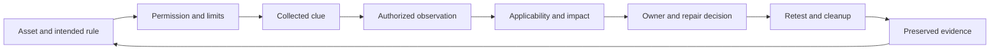

# Connections — from a security question to evidence and a decision

[Complete reading map](README.md) · [Every source heading](coverage.md) · [Chinese concept map](../handouts-zh/connections.md) · [Earlier cross-project map](../connections.md)

These are editorial connections between the supplied teaching text and the existing evidence owners. Each connection explains what can be reused and what still needs its own proof. A translation, a source note and an actual learner result have different roles.

## One reasoning chain

The diagram is a learning synthesis, not a mandatory attack chronology. At each transition, ask what additional evidence is needed. An archived page is a historical clue; a scan is an observation at a particular vantage; a service response is another observation; a vulnerability finding additionally needs applicability and impact analysis.

## Concepts and their existing evidence owners

| Plain-English section | Canonical material | How to use the connection | Evidence limit |
| --- | --- | --- | --- |
| [Properties and signatures](m01-foundations.md#p1-04) | [Audited M01 properties](../m01-foundations.md#security-properties) and [bank-email analysis](../m01-foundations.md#email-evidence) | Separate confidentiality, integrity, authenticity and evidence of an action when explaining the grade and email examples | A printed identifier is not a verified signature; cryptographic evidence does not predetermine a legal judgment |
| [Authorization and retesting](m01-foundations.md#p1-09) | [ROE teaching source](../../../source/2026-09-04-antisyphon-roe-101/source.md), [W36 authorization exercise](../../../projects/weekly-incident-projects/2026-W36-authorization-gate/README.md) | Translate hours, place, escort and method limits into a concrete scope and stop/resume check | Historical permission is scoped to the original exercise; no new test is activated |
| [Weakness, exploit, compromise](m01-foundations.md#p1-05) and [risk](m01-foundations.md#p2-05) | [September 15 weakness-to-harm lesson](../../m05-vulnerability-analysis/lesson-01-weakness-to-harm.md) | Reuse the missing per-record authorization example to separate flaw, action, observed loss and context-dependent priority | The grade example is hypothetical; its explanatory value does not supply a scan result or numeric risk score |
| [ARP, scanning and identification](m03-network-scanning.md#p2-24) | [W37 metadata comparison](../../../projects/weekly-incident-projects/2026-W37-forgotten-portal-discovery/continuation-2026-09-09-1948/metadata-comparison.md) | Compare endpoint reachability, missing inventory entry, service-reported role/version and accountable ownership | The saved fictional-loopback response reports metadata; ownership, deployed identity, vulnerability and exploitability remain separate questions |
| [DNS and registration](m02-reconnaissance.md#p2-15) | [DNS reconnaissance lab](../../../../nycu_114-2_network_security_practices/labs/dns-reconnaissance/README.md) | Use a record-by-record observation and interpretation format; distinguish a query from intrusive testing | The lab's task description is not proof of learner completion or authority to query a new target |
| [SID, tokens and DACLs](m01-foundations.md#p2-04) | [Windows access-control handout](../../../../nycu_114-2_network_security_practices/handouts/windows-access-control.md) | Connect principal → subject/token → object/security descriptor to a concrete access check | Stored ACLs and offline data encryption protect different boundaries; an unresolved display name does not erase permissions |
| [Cryptographic trust](m01-foundations.md#p1-04) and [transport completion](m03-network-scanning.md#p2-22) | [mTLS report evidence map](../../../../nycu_114-2_network_security_practices/homeworks/hw02-tls-bidirectional-certificates/report/evidence-map.md) | Read the existing valid-client, absent-certificate and wrong-CA cases as distinct checks of trust; keep TLS, HTTP and business outcomes separate | Existing evidence stays with the coursework. This capture neither reruns the lab nor copies private keys, generated certificates or captures |
| [Supervised and unsupervised learning](m01-foundations.md#p2-09) | [CSCM30018 image-processing/ML notes](../../../../nycu-115-1-coursework/cscm30018/lectures/2026-09-15-image-processing-ml-crime-detection/notes.md) | Connect labels, clustering, anomaly interpretation and evaluation to the actual question the model answers | A score or cluster is not a verified incident, a criminal attribution or an established detection rate |
| [AI suggestions and execution](m01-foundations.md#p1-10) | [AI-security research charter](../../../../ai-cybersecurity-agent-research/docs/research-charter.md) | Compare reasoning-only, tool use, execution feedback and constrained permissions as candidate evaluation conditions | The charter's comparisons and sandbox gates remain proposals until their own evidence exists; this note activates no experiment |

## Three boundaries that often get confused

**Identity versus permission.** A login, SID or certificate can establish an identity under particular assumptions. The requested action on the particular object still needs an authorization decision. Follow [M01 properties](m01-foundations.md#p1-04) through [Windows access checks](m01-foundations.md#p2-04) to the [grade-system retest](m01-foundations.md#p1-09).

**Observation versus inference.** A response, a version string, a location estimate and a claimed sender are observations of different kinds. The next conclusion requires its own conditions. Follow [reconnaissance](m02-reconnaissance.md#p2-11), [email evidence](m02-reconnaissance.md#p2-17), [service identification](m03-network-scanning.md#p2-26) and the [worked scan interpretation](m03-network-scanning.md#worked-example).

**Data versus authority.** A form input, a report read by an AI, and service metadata can provide information without acquiring the right to direct a privileged action. [SQL injection in the overview](course-overview.md#p1-02), [threat modeling](m01-foundations.md#p2-07) and [prompt injection](m01-foundations.md#p1-10) share a useful boundary question while retaining different technical mechanisms. This analogy does not make the vulnerabilities interchangeable.

## Course and practical routing

| Reading theme | Course connection | Existing practice route |
| --- | --- | --- |
| Properties, permission, risk and evidence | M01, shared across all modules | [M01 question form](../../../assessments/practice-bank/m01.md); governance applies to P1–P5 |
| Sources, DNS, host/port/service/OS observations | M02–M04; applicability proceeds to M05 | [M02](../../../assessments/practice-bank/m02.md), [M03](../../../assessments/practice-bank/m03.md); P1 scanning and P2 service information |
| Packets, TCP, sessions and cryptographic trust | M08, M11 and M20 | P3 traffic analysis; distinguish captured transport from readable content |
| Endpoint behavior, malware, social engineering and defenses | M06, M07, M09 and M12 | P4 system-attack analysis |
| Web-server configuration, per-record access and query structure | M13–M15 | P5 web-application analysis and repair validation |
| Wireless, mobile, OT and cloud boundaries | M16–M19 previews | Return to the [official scope map](../../../curriculum/official-scope-map.md) before expanding depth |

The [practical task file](../../../assessments/practice-bank/practical.md) owns the actual declared acceptance checks. No answer keys are copied into this reading edition. The [current route](../../../study-plan/uuu-aligned-ceh-cehp-2026-09-18.md) owns teaching/drill modes, original answers, confidence and separate error retests. This material is source preparation, not another attempt.

## Planning and later publication

[Today's FIRST PRINCIPLE receipt](../../../../planning-everything-track/weeks/2026-W39/days/2026-09-21.md#ceh-plain-english-first-principle), [W39 capacity](../../../../planning-everything-track/weeks/2026-W39/weekly-plan.md#ceh-plain-english-september-21) and the [CEH project locator](../../../../planning-everything-track/data/projects/2026-07-ceh-cehp-certification-training.md#ceh-plain-english-september-21) retain status, available-time boundaries and Git receipts. The CEH repo retains this complete technical material.

The [daily Blog contract](../../../study-plan/uuu-aligned-ceh-cehp-2026-09-18.md#daily-bilingual-blog-acceptance--september-21) requires Jason's explanation and confirmation before treating an article as his learning output. The [website publishing workflow](../../../../JasonLn0711.github.io/docs/learning-publishing.md) owns public text and deployment. This English source can support fact and terminology review; it is not a learner-authored Blog or authorization to publish an article.

CEH and CEHP still share at most 240 self-study minutes per week and at most 25 on a class day. Use the relevant section to answer an existing learning question. This capture adds no schedule, reading quota, research workstream or holiday recovery debt.
