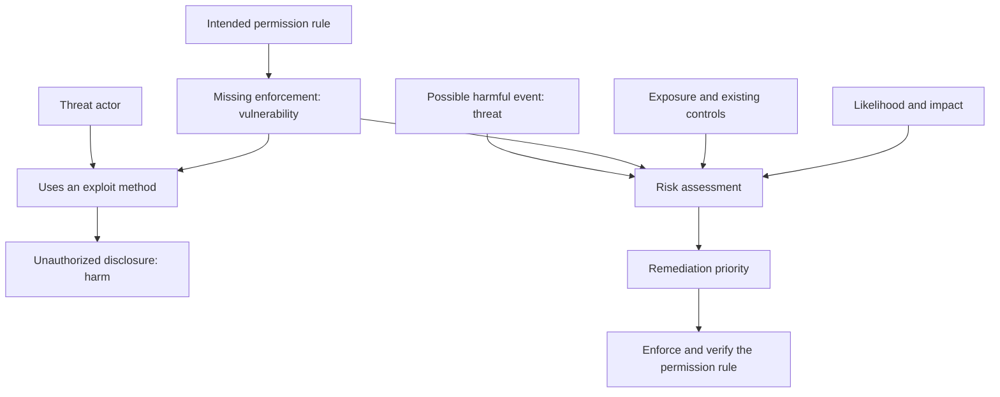

# Lesson 1 — How a weakness can lead to harm

Captured: 2026-09-15, Asia/Taipei. Primary module: M05 Vulnerability Analysis.

The lesson gives Jason a vocabulary for separating a weakness, a possible harmful event, the method that uses the weakness, and the resulting harm. This supports finding interpretation and remediation decisions before more detailed M06 material.

## Source and evidence

- [Full supplied lesson](../../source/2026-09-15-lesson-01-weakness-to-harm/source.md): complete user-provided text, examples, question and six reference definitions preserved. Author and original teaching date were not supplied; the date above is the capture date.
- [Source receipt and verification](../../source/2026-09-15-lesson-01-weakness-to-harm/README.md): provenance, wording correction and source-check limits.
- Jason supplied the lesson and requested full capture and connections. Codex organized the notes and checked sources. Audience: Jason's CEH study and later review.
- Documentation is complete; reading, explain-back, confidence, elapsed study time and assessment results remain unreported. No learner attempt or score is created from this source.

## Concept map

This diagram describes a deliberate-attack scenario. Accidental events can also cause harm; risk can be assessed before any event occurs.

| Concept | Question it answers | University example | Useful distinction |
| --- | --- | --- | --- |
| Asset and policy | What are we protecting, and who may use it? | Private feedback; students may read their own records | The intended rule establishes the security boundary |
| Authentication | Who is requesting access? | The student has logged in | Identity alone does not establish document permission |
| Authorization | May this identity perform this action on this object? | Check ownership before returning feedback | Enforce the rule for each relevant request |
| Vulnerability | What is weak? | Missing document permission check | A weakness can exist before an attack |
| Threat actor | Who could deliberately cause harm? | A student seeking others' feedback | The person is separate from the weakness |
| Threat event | What harmful event could occur? | Unauthorized reading of another student's feedback | A possibility is separate from an observed incident |
| Exploit / exploitation | How is the weakness used? | A request that obtains someone else's document / making that request | Method, action and result are distinct |
| Impact | What would be lost? | Confidentiality of private feedback | The example demonstrates disclosure; other harms need their own evidence |
| Risk | How plausible and consequential is harm here? | Compare exposure and data sensitivity in classroom and production copies | Same weakness can produce different priorities |
| CVSS Base severity | How severe is the vulnerability in base technical terms? | A technical input to prioritization | An organizational risk decision also needs context |

Definitions and mechanism: [NIST vulnerability](https://csrc.nist.gov/glossary/term/vulnerability), [threat](https://csrc.nist.gov/glossary/term/threat), [risk](https://csrc.nist.gov/glossary/term/risk), [OWASP 2021 access control](https://owasp.org/Top10/2021/A01_2021-Broken_Access_Control/), and [FIRST CVSS v4.0](https://www.first.org/cvss/v4.0/user-guide).

## Reading clarification

The source sentence “Imagine that the university removes the missing permission check” should be read as **the university adds the missing permission check and enforces document ownership**. This is an editorial correction to the companion notes; the source remains unchanged.

The glossary entries offer definitions drawn from several publications. These notes use the security-policy weakness, potential adverse event, and likelihood/impact senses used in the lesson. The exploit definition is a teaching synthesis illustrated by OWASP's examples, rather than a verbatim NIST definition.

## From finding to decision

A useful M05 reasoning sequence is: identify the intended rule, describe the observed weakness, explain a plausible use of it, identify affected assets and exposure, then justify a repair priority. Scanner output would be an initial observation requiring interpretation; this supplied hypothetical already stipulates the missing check.

For the university example, the defensive objective is server-side permission enforcement. A proposed synthetic check would confirm that a student can read their own feedback while another student's record is withheld. OWASP supports ownership enforcement and access-control tests. This describes a possible future check; no system was tested during note capture.

The classroom-versus-production comparison is a qualitative judgment under the supplied assumptions. It supplies no numeric probability, risk score or CVSS vector. Reachability, data sensitivity and effective controls should be established before a real prioritization decision.

## Equifax connection

The supplied lesson uses Equifax 2017 to connect vulnerability, exploitation and realized loss. Its approximately 147 million affected people and March 2017 patch-warning statements are supported by the FTC search result obtained on capture day. Full retrieval of the cited announcement timed out; administrative-credential and July-detection details remain source-reported in this capture. Preserve the FTC's allegation wording.

This is a second example of the conceptual model. The university's missing authorization check is hypothetical and does not describe the Equifax root cause. The mapping of incident facts into the four concepts is teaching interpretation. [FTC announcement](https://www.ftc.gov/news-events/news/press-releases/2019/07/equifax-pay-575-million-part-settlement-ftc-cfpb-states-related-2017-data-breach).

## Connections and reuse

| Existing home | Connection | How to reuse this lesson |
| --- | --- | --- |
| [Official scope map](../../curriculum/official-scope-map.md) — M05 | Weakness, exploitability, impact and priority | Use the four concepts when explaining a finding |
| Same scope map — M06 | Exploitation and privileges | Carry the distinction between method and result into system-hacking concepts |
| Same scope map — M11 / M14 | Authentication, authorization and application behavior | Explain why a logged-in user can still cross an object-permission boundary |
| Same scope map — M13 / M19 | Patching and cloud IAM | Transfer the model to different mechanisms without assuming identical causes |
| [Competency map](../../assessment-governance/competency_map.csv) — CEH-M05-L2 / CEH-M06-L2 / CEH-M14-L2 | Concept-to-claim traceability | Supporting study material; formal evidence requirements and scores stay independent |
| [Assessment governance](../../assessment-governance/README.md) | Attempts and scoring | Store an actual learner response separately when supplied |
| [Important references](../../curriculum/important-references.md) | Primary-source selection | Follow the dated source receipt rather than treating a simplified definition as a full standard |
| [Existing preparation plan](../../study-plan/pre-course-prep.md) | Historical preparation context | Current exam-only routing comes from Planning; local historical project requirements are not activated by this capture |
| [Planning CEH locator](../../../planning-everything-track/data/projects/2026-07-ceh-cehp-certification-training.md) | Active scope and ownership | Find current exam-only decisions and the missing-schedule custody note |
| [W38](../../../planning-everything-track/weeks/2026-W38/weekly-plan.md) / [September 15](../../../planning-everything-track/weeks/2026-W38/days/2026-09-15.md) | Capacity and next learning gate | Reuse within existing time; preserve M06 and fixed commitments |

## Continuation and completion boundary

The source ends with an unanswered three-to-five-sentence explain-back and confidence prompt. Preserve that prompt as the next source-defined learning opportunity; an answer must come from Jason. This capture creates no additional quiz, remediation schedule or completion claim.

If resumed as interactive learning, follow the active teaching contract: one original module question set across sessions, choice/confidence captured one question at a time, and separate correction/retest scores. Resolve pending material within a fresh agreed endpoint. The lesson is supporting M05 material, not a replacement for today's planned M06 outcome.

The local checkout lacks `study-plan/ceh-exam-only-2026-09-11.md` and `study-plan/professor-prompt-2026-09-14-m05.md`, both referenced by Planning. Their contents were not reconstructed. The Planning scope decision remains available through the working locator above; restoring the original files is a separate custody gate.

## Week 1 connection and restored routes — September 20

[Week 1 M01 risk and vulnerability notes](../2026-09-20-ceh-week-01/m01-foundations.md#risk) extend this lesson's weakness/exploit/impact distinctions; [M03 interpretation](../2026-09-20-ceh-week-01/m03-network-scanning.md#interpretation-chain) explains why a service/version match is only an input to applicability and risk analysis. The original explain-back remains unanswered in this source record.

The approved synchronization restored the previously missing September 11 plan, September 14 prompt and [September 18 current route](../../study-plan/uuu-aligned-ceh-cehp-2026-09-18.md). Earlier missing-file statements above remain historical capture notes; [the source receipt](../../source/2026-09-20-ceh-week-01/README.md#checkout-restoration-and-preservation) records the restoration without changing learner evidence.

## September 21 handout connection

[中文講義一：weakness / exploit / compromise / risk](../2026-09-20-ceh-week-01/handouts-zh/part-01.md#h1-05) reuses the missing-record-authorization example; [講義二：risk treatment](../2026-09-20-ceh-week-01/handouts-zh/part-02.md#h2-05) adds change-management context. These are concept links; the original learner prompt and historical evidence state remain unchanged.

## Complete plain-English reading connection

The merged handout’s [weakness-to-compromise explanation](../2026-09-20-ceh-week-01/plain-english/m01-foundations.md#p1-05) and [risk-treatment discussion](../2026-09-20-ceh-week-01/plain-english/m01-foundations.md#p2-05) supply a continuous English route back to this lesson. [Scan interpretation](../2026-09-20-ceh-week-01/plain-english/m03-network-scanning.md#worked-example) explains why reachability and product clues still need applicability analysis. Learner evidence remains in the original attempt records.
