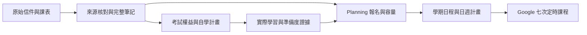

# CEH／CEHP 改班、付款、權益與課表完整筆記

查核日：2026-09-18，Asia/Taipei。最新報名為 **CEH 2053 班、CEHP 26416 班**；付款通知支持 **NT$65,000 信用卡一次付清**。發票已獲同意開立，實際發票尚待取得。正式課、自學成果、考試預約、考試通過及證照核發分開記錄。

## 來源與保管

稀缺資源為課程期間的時間、恢復空間及可信證據。CEH repo 擁有本筆記、考試權益解讀及學習安排；Planning 擁有報名狀態、容量、日程與私人來源保管。公開查證只能核對一般課程與政策，不能驗證私人交易結算。

| ID | 來源／覆蓋 | 本次取得與核對 |
| --- | --- | --- |
| R01 | Downloads 的 `CEH_CEHP_verified_chronology_2026-09-18.md`，完整十節與來源登錄 | 原文完整保留；屬整理紀錄，與原件逐項核對 |
| P01 | 報名／改班往返信，6 頁、6 封訊息 | SHA-256 與 R01 相同；6 頁文字及渲染頁逐頁核對；本機檔名未含原登錄的 `(3)`，位元內容相同 |
| P02 | 9/18 10:19 訂單付款通知，2 頁 | SHA-256 相同；逐頁核對請款明細及頁尾 |
| P03 | 藍新付款結果通知，1 頁 | SHA-256 相同；逐頁核對金額、方式、結果與完成時間 |
| P04 | CEH 2053 開課通知，3 頁 | SHA-256 相同；逐頁核對日期範圍、樓層指示、地圖及兩個附件名稱 |
| P05 | 原始課程行事曆 PDF，1 頁 | Downloads 原件；五次日期／時間與講師欄已視覺核對；SHA-256 `a263d949bcd48d1030234be7c543a901546b7bced1154fdc8cdaad561390f97c` |
| C01 | P04 原始 Gmail 郵件的課程 ICS | 連接器完整抽取內容，1,624 bytes、5 個 VEVENT，未截斷；原檔下載回傳 HTTP 403，保存抽取版，未宣稱原始下載位元驗證 |
| I01／I02 | R01 登錄的付款前畫面兩份 | 本機未找到；R01 記載兩者雜湊相同。本次未重新驗證去重，也不計為兩筆付款 |
| I03 | R01 登錄的商家付款成功畫面 | 原圖未找到；已付 65,000、餘額 0 為 R01 轉述，與可直接核對的 P03 分列 |
| I04 | R01 登錄的開課回覆成功畫面 | 原圖未找到；無可見時間／班號，與 2053 班的關聯仍屬 R01 的情境推論 |

[私人來源索引](../../../planning-everything-track/.local/ceh-cehp/2026-09-18/manifest.json)保存檔名、位元數、雜湊、來源與缺件。相鄰 `originals/` 保存 R01 與五份 PDF（共 13 頁）；`vendor-calendar-extracted.ics` 保存 C01；`extracted/`、`rendered/` 保存核對材料。此路徑為本機限定，Git clone 不會包含原件；筆記保留可攜的來源 ID／頁碼。聯絡資料、匯款帳戶、訂單／交易 ID、付款網址及受邀者地址僅留私人保管區。

原件文字抽取有中文缺字，重要欄位以 PDF 渲染頁核對。雜湊一致證明檔案一致，並不等於寄件人或銀行結算的獨立認證。R01 不覆寫；新增取得的 P05／C01 補足其「課表附件未取得、講師未知」欄位。

## 報名與交易時間線

| ID | 台北日期／時間 | 事件及狀態變更 | 來源 |
| --- | --- | --- | --- |
| E01 | 7/1 15:59 | Cindy 確認雙認證方案：CEH 2046（8/3–7）及 CEHP 26408（9/6、13），方案 65,000 元 | P01 p.1 |
| E02 | 7/13 15:43 | Jason 因工作安排申請改為 CEH 2048（10/12–16）、CEHP 26416（11/19–20） | P01 p.3 |
| E03 | 7/13 16:08 | Cindy 書面確認兩班轉換成功；原班別成為歷史 | P01 pp.3–4 |
| E04 | 9/18 09:58 | 電話後確認 CEH 提前改至 2053，列出五次日期；CEHP 26416 保留；要求中午前付款 | P01 pp.4–5 |
| E05 | 9/18 10:08 | Jason 請求刷卡及國立陽明交通大學抬頭、統編 87557573 | P01 p.5 |
| E06 | 9/18 10:19 | 請款通知顯示當時未付 65,000 元 | P02 p.1 |
| E07 | 9/18 10:21 | Cindy 同意刷卡後開立所指定的機構發票 | P01 p.5 |
| E08 | 9/18 10:21:14 | 藍新記載信用卡一次付清 65,000 元、付款成功 | P03 p.1 |
| E09 | 9/18 10:22 | 藍新寄出同一筆付款結果通知 | P03 p.1 |
| E10 | 9/18 10:22 | Cindy 寄出 CEH 2053 開課通知與課表附件 | P04；P05；C01 |

郵件 PDF 的時間精度通常到分鐘；E08 精度到秒。E07 與 E08、E09 與 E10 的列序不代表已證實的秒級先後。電話內容與時間未提供，PDF 10:23 頁尾是匯出時間。C01 的 DTSTAMP 為檔案事件記錄時間，不當成上課、付款或回覆時間。I01–I04 的畫面時間仍未知。

三次班別選擇是同一方案的修訂，不新增三份學費。2046、2048、26408 保留為歷史；未據此認列任何出席。

## 有效課表

| Session ID | 日期 | 星期 | 課程／班別 | 開始 | 結束 | 講師 | 來源 |
| --- | --- | --- | --- | --- | --- | --- | --- |
| CEH2053-S01 | 2026-09-20 | 日 | CEH 2053 | 09:00 | 18:00 | 趙驚人 | P01 p.4；P05；C01 |
| CEH2053-S02 | 2026-10-04 | 日 | CEH 2053 | 09:00 | 18:00 | 趙驚人 | P01 p.4；P05；C01 |
| CEH2053-S03 | 2026-10-18 | 日 | CEH 2053 | 09:00 | 18:00 | 趙驚人 | P01 p.4；P05；C01 |
| CEH2053-S04 | 2026-10-25 | 日 | CEH 2053 | 09:00 | 18:00 | 趙驚人 | P01 p.4；P05；C01 |
| CEH2053-S05 | 2026-11-01 | 日 | CEH 2053 | 09:00 | 18:00 | 趙驚人 | P01 p.4；P05；C01 |
| CEHP26416-S01 | 2026-11-19 | 四 | CEHP 26416 | 09:00 | 17:00 | 未提供 | P01 p.5 |
| CEHP26416-S02 | 2026-11-20 | 五 | CEHP 26416 | 09:00 | 17:00 | 未提供 | P01 p.5 |

全部使用 Asia/Taipei。CEH 共 40 教學小時；CEHP 共 14，合計 54。每次 8／7 教學小時是平均分配推算，實際出席計算依課方；日程占用為 5×9＋2×8＝61 小時，另需通勤與恢復。

9/27、10/11 不上 CEH；10/25 明列上課。P05 列出 9/25–28、10/9–11 及 10/26 的假日／停課列；政府假日不自行取消私人課程。五次課程跨七個週日，使用明列日期，不建立每週重複規則。官方課表與課程名稱中的 CEH13／網站 CEH13-AI 是來源用語；實際交付教材版本待領取核對。

C01 的 DTSTART／DTEND 是未帶 TZID 或 UTC 後綴的浮動時間。Google 事件明確加上 +08:00 與 Asia/Taipei；五個原始 UID 僅作私有來源對照。C01 只有 CEH 五堂，CEHP 兩堂由 P01 支持，不宣稱 ICS 含七堂。

## 付款、發票與權益

| 明細 | 原列價格 | 本訂單配置 |
| --- | ---: | ---: |
| CEH | 65,000 | 58,500 |
| CEHP 總複習 | 40,000 | 6,500 |
| 合計（TWD） | 105,000 | 65,000 |

P02 的未付款狀態與 P03 的後續成功紀錄屬不同時間。付款方式是信用卡一次付清；華南銀行欄位是「款項保管銀行」，不推定為信用卡發卡銀行。未查銀行帳單、結算、退款或爭議款狀態；不再建立付款待辦。

P01 p.5 同意發票買受人國立陽明交通大學、統編 87557573、日期 2026/9/18、品項「教育訓練」、單價 65,000、數量 1、總額 65,000。W10 支持學校統編，實際發票號碼、開立時間及校方報帳核准仍未知。「發票開立後不予更換」保留為業者原說法，未推為法律結論。後續刷卡同意取代先前匯款建議。

| 套裝項目 | 文件約定與操作 | 仍需確認 |
| --- | --- | --- |
| 促銷 | 65,000 元雙認證方案，活動至 2026/12/31；兩課及兩認證考試須在 CEH 開課起一年內完成 | 改班後適用起算點及截止日 |
| CEH 首考 | 含 312-50 首考；課後憑 Exam Voucher Code 在恆逸考試中心登記 | 本人券種、收到／購買／到期日及考場路徑；USD950 為信中歷史參考價 |
| Practical 首考 | 含 Certified Ethical Hacker (Practical)；啟用 CEH Subscription Code 後依 ASPEN Practical 項目安排 | 代碼交付、啟用及效期；USD550 為歷史參考價 |
| CEH 免費重考 | 首考失敗後有兩次免費重考，均須在課程起算一年內完成；最多三次已含 CEH 應試 | 適用個人方案及監考費；不延伸為 Practical 免費重考 |
| 第一次免費重考 | 由 ASPEN 申請 | 首考實際失敗後才觸發 |
| 第二次免費重考 | 第一次重考失敗起一個月內向恆逸申請；送出後五個工作天未回覆再聯繫 | 依實際失敗日及券上效期 |
| 額外 CEH 重考 | 兩次免費重考用畢仍失敗，信件列 3,000 元（對照 USD499） | 第二次免費重考失敗起一個月內申請，仍受一年窗口；非目前待付款 |
| 官方 Lab | 自啟動日起 180 天 | 啟動日、顯示到期日均未知；不從付款日或第一堂自動起算 |
| 同版重聽 | CEH 開課起半年內一次免費重聽 | 名額、適用版本與精確截止 |
| 課程結訓證書 | CEH 出席至少 80%；40×80%＝32 小時僅為門檻算式 | 課方出席核算；不等同 EC-Council 證照 |
| 學生替代優惠 | 信列 IT 職涯學習護照 CEH 32,500 元，不可併用 | 歷史替代方案，非本次購買內容或自動退費權利 |
| PDU | 信列 PMI 授權中心 3150、可登錄 PDU | 業者陳述；未獨立確認當期資格、點數及接受結果 |

P01 pp.1–2 是個人約定；後續改班信沒有重列完整條款。公共宣傳不得擴張個人權益。尚無首考或重考結果，所有失敗觸發的申請窗口均未啟動。

## 分開記錄期限

| 時鐘 | 可記錄的日期／條件 | 狀態 |
| --- | --- | --- |
| 活動截止 | 2026-12-31 | 促銷日期，不是本人考試截止 |
| 同版重聽 | 若適用 2026-09-20 起算，半年周年為 2027-03-20 | 試算；最終含當日與否待業者確認 |
| 套裝完成／免費重考 | 同假設的一年周年為 2027-09-20 | 試算；不建立硬截止提醒 |
| Lab | 實際啟動日＋180 天 | 日期未知 |
| CEH voucher | W09 通則為購買日起最多一年；W05 FAQ 又寫收到日起一年 | 保留來源差異，核對本人券面／系統與業者 |
| Practical dashboard | W06 寫收到日起一年；預約至少提前三天且視空位 | 日期未知；課程日期不是考試預約 |
| 後續重考申請 | 特定失敗日起一個月；原廠另有冷卻期 | 尚未觸發 |

本機不啟用代碼、不登記考試，也不建立未證實效期的提醒。CEH 準備度評估以 11/1 課程結束為觸發，待實際學習證據後選擇考試日期。

## 到場、聯絡與課前準備

建物地址一致為台北市松山區復興北路99號。9/18 09:58 信列 16 樓，開課通知列 10 樓，較早信件／地圖／行政頁尾列 14 樓；**當日依一樓電子看板公告確認教室**。P05 的 14 樓是頁尾地址，不解決實際教室差異。CEHP 的最終教室與專屬開課通知仍待課方。

P04 指示南京復興站文湖線 7 號出口／松山新店線 6 號出口；屬通知轉錄，未另驗車站動線。P01 指示自備文具與保溫杯，設備、教材及環境由課方提供；有冰箱與微波爐。午餐不含，信列便當 80 元、上午休息自行向櫃台訂購；午休約 12–13 時，上午／下午各約 10–15 分鐘，依講師下課時間。餐費及設備以當日確認。

Cindy 的諮詢時段為週一至週五 09:00–18:30；9/25–10/4 為個人休假預告，不代表中心關閉或 10/4 停課。完整電話／分機與信箱保存在 R01／原信；需要時使用來源中的業務或中心總機。P03 商品、退貨、退款問題導向原商家，並提醒勿相信刷卡分期／連續扣款／要求加 LINE 提供帳號的來電；藍新客服管道由 W11 核對。開課通知表示不再重寄，須保留本次附件。

## 公開查證登錄

以下均於 2026-09-18 線上查閱。來源為公開官方網站；未登入付款、銀行或 ASPEN 帳戶。索引摘錄保留較弱證據標示，不用舊簡章覆蓋最新個人約定。

| ID | 官方來源 | 本次支持與限制 |
| --- | --- | --- |
| W01 | [恆逸 CEH 課程](https://uuu.com.tw/Course/Show/3236/EC-Council-CEH%E9%A7%AD%E5%AE%A2%E6%8A%80%E8%A1%93%E5%B0%88%E5%AE%B6%E8%AA%8D%E8%AD%89%E8%AA%B2%E7%A8%8B) | 官方搜尋索引列 2053、9/20–11/1、週日09–18、40小時；直接頁面讀取不完整。五次精確日期由 P01/P05/C01 支持 |
| W02 | [恆逸 CEHP 課程](https://www.uuu.com.tw/Course/Show/1609/CEH%E5%A4%A7%E5%B8%AB%E9%9B%99%E8%AA%8D%E8%AD%89%E5%AF%A6%E6%88%B0%E8%80%83%E8%A9%A6%E7%B8%BD%E8%A4%87%E7%BF%92%E7%8F%AD) | 官方索引列 26416、11/19–20、週四五09–17；完整頁面未取得。14小時亦由 P01 支持 |
| W03 | [恆逸 CEH 套裝說明](https://uuu.com.tw/Course/Show/3236/EC-Council-CEH%E9%A7%AD%E5%AE%A2%E6%8A%80%E8%A1%93%E5%B0%88%E5%AE%B6%E8%AA%8D%E8%AD%89%E8%AA%B2%E7%A8%8B) | 官方索引支持 65,000元、活動至12/31及CEH開課起一年完成條件；舊簡章的6/30活動截止不適用這次個人約定 |
| W04 | [恆逸第二次免費重考申請](https://exams.uuu.com.tw/CEH_Exams/reexamine.aspx) | 完整頁面：適用CEHv13優惠者、開課一年內兩次免費重考、首重考走ASPEN、二重考申請一個月內；未送出表單 |
| W05 | [CEH certification specifications](https://cert.eccouncil.org/certified-ethical-hacker.html) | 312-50、125題、4小時；依試卷60–85%門檻。頁面考場與voucher起算文字有內部／跨頁差異，保留本人券種確認關 |
| W06 | [CEH Practical](https://cert.eccouncil.org/certified-ethical-hacker-practical.html) | 20挑戰、6小時、Aspen–iLabs；dashboard收到日起一年，至少提前三天預約；個人代碼未驗證 |
| W07 | [CEH 與 Master 路徑](https://www.eccouncil.org/train-certify/certified-ethical-hacker-ceh/) | 知識與Practical成功形成Master路徑；通用MCQ重考優惠註明不含監考費，恆逸個人方案處理方式待確認 |
| W08 | [原廠重考政策](https://cert.eccouncil.org/exam-retake-policy.html) | 首次重考無等待期；第3、4、5次應試各有14天等待；12個月最多5次，第6次另有12個月等待。優惠券不豁免政策 |
| W09 | [Voucher 與展延政策](https://cert.eccouncil.org/exam-voucher-extension-policy.html) | 通則購買日起最多一年；延長選項依有效／過期狀態及費用，最多展延一次，建議至少到期前5工作日聯絡。個人日期及適用性待確認 |
| W10 | [陽明交大官方頁面](https://fund.nycu.edu.tw/) | 頁尾統編87557573；不證明報帳核准或發票開立 |
| W11 | [藍新金流官方網站](https://www.newebpay.com/) | 客服管道與原通知相符；沒有交易特定驗證 |
| W12 | [人事行政總處115年行事曆](https://www.dgpa.gov.tw/information?pid=12573&uid=41) | 已讀官方頁面與年度PDF；政府日曆供假日背景，私人課程以明列日期為準 |

## 學習與跨檔案連結

| 來源變化 | 執行／學習影響 | 權威入口 |
| --- | --- | --- |
| CEH提前至9/20、11/1結課 | 週日正式課另計固定承諾；自學每週最多240分鐘，上課日最多25分鐘；課後才評估考試準備度 | [現行考試導向計畫](../../study-plan/ceh-exam-only-2026-09-11.md#september-18-course-change) |
| P05講師與五堂日期 | 按實際講授保存章節／疑問，不推測每堂四個module或教材已交付 | [官方範圍](../../curriculum/official-scope-map.md)、[課後學習記錄規則](../../study-plan/ceh-exam-only-2026-09-11.md#september-18-course-change) |
| NT$65,000付款完成 | 關閉付款待辦；發票／效期／監考費維持不同確認關 | [Planning報名locator](../../../planning-everything-track/data/projects/2026-07-ceh-cehp-certification-training.md#september-18-current-registration) |
| 10/12–16改班解除 | NYCU課程、10/13 TA與HWDC不再有舊CEH衝突；其他既有衝突仍在 | [學期日程](../../../planning-everything-track/docs/07-semester-calendar.md#ceh-cehp-explicit-sessions)、[TA](../../../planning-everything-track/data/projects/2026-09-cscm30018-teaching-assistant.md)、[HWDC](../../../planning-everything-track/data/projects/2026-09-hello-world-dev-conference-2026.md) |
| 11/19 CEHP維持 | 與MDCM30019、HAI proposal重疊，11/12前確認課方替代方案 | [課務控制面](../../../planning-everything-track/data/projects/2026-09-nycu-115-1-coursework.md) |
| 考試與受訓證據不同 | 保留原始／重測成績；本次文件與行事曆更新不新增 learner minutes、實作或證照 | [準備度](../../assessment-governance/readiness_dashboard.md)、[9/18紀錄](../../../planning-everything-track/weeks/2026-W38/days/2026-09-18.md#ceh-cehp-update) |

[7/1方案與解讀](../2026-07-01-ucom-registration/analysis-and-study-bridge.md)、[7/8改班決策](../2026-07-08-course-change-decision-gate/decision-record.md)、[7/13成功改班](../2026-07-13-ucom-successful-class-transfer/registration-transfer-confirmation-agent-readable-redacted.md)保留前後來源；[source index](../README.md)、[repo入口](../../README.md)、[年末路線圖](../../../planning-everything-track/data/projects/2026-09-ai-cybersecurity-year-end-roadmap.md)回連本次狀態。較早日誌不重寫當時事實。

## 待確認事項與驗收

| 下一關 | Owner／觸發 | 可觀察成果 |
| --- | --- | --- |
| 首堂到場與私人行程 | Jason，9/20上課前 | 9/19–20原私人行程與交通可相容；私人行程保持原狀，Free標籤不代表本人有空 |
| 教室 | Jason／恆逸，每次到場 | 一樓看板確認實際樓層；不以行政頁尾推定 |
| 發票 | Jason／恆逸，下次行政核對 | 實際發票檔、號碼、抬頭、統編及65,000元相符；報帳另依校方 |
| 代碼與效期 | Jason／恆逸，領碼及啟用／預約前 | 分別記錄voucher、Practical dashboard、Lab及方案適用截止與監考費 |
| CEHP衝堂 | Jason／課程負責人，11/12前 | MDCM30019與HAI proposal的核准出席／替代路徑 |
| 準備度 | Jason，11/1結課後 | 範圍、錯題與未見題練習證據，再決定考試日期 |

文件驗收：P01–P05共13頁有來源覆蓋；C01五事件與P01/P05一致；另加P01支持的CEHP兩堂，共七堂；54教學小時／61時段小時；I01–I04缺件明列。行事曆與repository驗收回執保存在[當日關聯紀錄](../../../planning-everything-track/weeks/2026-W38/days/2026-09-18.md#ceh-cehp-update)，與未完成的真人行政／學習關卡分開。
